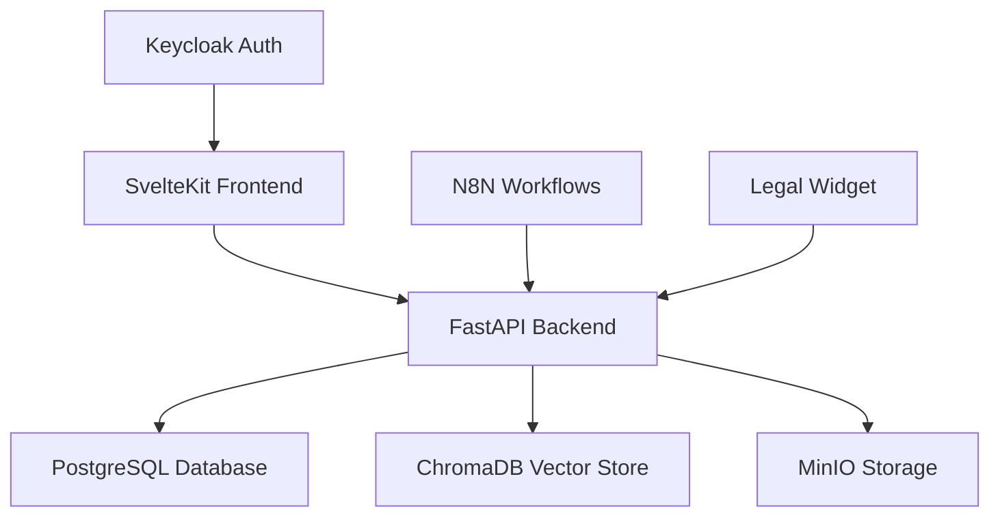

# Verdict360 Legal Chatbot Platform

> **AI-powered legal SaaS platform for South African law firms**  
> Complete solution with embeddable widgets, voice integration, and legal intelligence

## 👥 Developer Quick Links

- 🔧 **[API Documentation](http://localhost:8000/docs)** - Interactive FastAPI docs
- 📱 **[Widget Integration](WIDGET_INTEGRATION.md)** - Complete embedding guide
- 🏗️ **[Project Context](CLAUDE.md)** - Architecture & guidelines
- 🧪 **[Testing Guide](#testing--validation)** - Quality assurance
- 🚀 **[Production Deploy](#production-deployment)** - Deployment guide

[](LICENCE)
[](https://python.org)
[](https://typescriptlang.org)
[](https://kit.svelte.dev)
[](https://fastapi.tiangolo.com)

## 🚀 Quick Start

```bash
# Clone and start development environment
git clone <repository-url>
cd verdict360-app
chmod +x start-dev.sh
./start-dev.sh
```

**Access Points:**
- 🌐 Frontend: http://localhost:5173
- 🔧 API Docs: http://localhost:8000/docs  
- 🧪 Widget Test: http://localhost:5173/widget

## 🏗️ Architecture Overview



### Tech Stack

| Component | Technology | Purpose |
|-----------|------------|----------|
| **Frontend** | SvelteKit + TypeScript + Tailwind | Professional legal interface |
| **Backend** | FastAPI + Python | Legal API & AI processing |
| **Database** | PostgreSQL + ChromaDB | Relational & vector data |
| **Auth** | Keycloak | Enterprise authentication |
| **Storage** | MinIO | Document & media storage |
| **Automation** | N8N | Legal workflow automation |
| **Widget** | Vanilla JS | Embeddable legal assistant |

## 📋 Project Status

| Component | Status | Completion |
|-----------|--------|-----------|
| 🔧 Backend API | ✅ Complete | 95% |
| 🌐 Frontend Dashboard | ✅ Complete | 80% |
| 🤖 AI Legal Assistant | ✅ Working | 90% |
| 📱 Embeddable Widget | ✅ Working | 85% |
| 📞 Voice Integration | 🚧 In Progress | 60% |
| 📊 Analytics Dashboard | 🚧 In Progress | 40% |
| 📅 Calendar Integration | 🚧 In Progress | 30% |

## 🛠️ Development Setup

### Prerequisites

- **Docker** 24.0+ & Docker Compose 2.0+
- **Node.js** 18+ with npm 9+ (for frontend development)
- **Python** 3.11+ with pip (for backend development)
- **Git** 2.34+ for version control
- **Make** (optional, for convenience scripts)

### System Requirements

- **RAM**: 8GB minimum, 16GB recommended
- **Storage**: 5GB available space
- **Network**: Internet connection for dependencies
- **OS**: macOS, Linux, or Windows with WSL2

### One-Command Setup

```bash
# Start complete development environment
chmod +x start-dev.sh
./start-dev.sh
```

**What this does:**
- ✅ Validates Docker is running
- ✅ Creates `.env` from template
- ✅ Starts all services via Docker Compose
- ✅ Runs health checks
- ✅ Displays service URLs and status

### Manual Development Setup

```bash
# Backend development
cd api-python
python -m venv venv
source venv/bin/activate  # or `venv\Scripts\activate` on Windows
pip install -r requirements.txt
python main.py

# Frontend development (new terminal)
cd web
npm install
npm run dev

# Full Docker stack
docker-compose up -d
```

## 🌐 Service Endpoints

| Service | URL | Credentials | Purpose |
|---------|-----|-------------|----------|
| 🌐 **Frontend** | http://localhost:5173 | - | Main legal dashboard |
| 🔧 **API Docs** | http://localhost:8000/docs | - | Interactive API documentation |
| 🤖 **Widget** | http://localhost:5173/widget | - | Embeddable legal assistant |
| 🔐 **Keycloak** | http://localhost:8080 | `admin/admin` | User management |
| 📦 **MinIO** | http://localhost:9001 | `minioadmin/minioadmin` | File storage |
| 🔄 **N8N** | http://localhost:5678 | `admin/admin123` | Workflow automation |
| 🗄️ **PostgreSQL** | `localhost:5432` | See `.env` | Database access |

## 🧪 Testing & Validation

### Quick Health Check

```bash
# Verify all services are running
docker-compose ps

# Test API connectivity
curl -s http://localhost:8000/health

# Test legal AI assistant
curl -X POST http://localhost:8000/api/v1/simple-chat/ \
  -H "Content-Type: application/json" \
  -d '{"message": "What is contract law?"}'
```

### Frontend Testing

```bash
# Development server with hot reload
cd web && npm run dev

# Production build and preview
cd web && npm run build && npm run preview

# Type checking (runs in CI)
cd web && npm run typecheck

# Linting with auto-fix
cd web && npm run lint
cd web && npm run lint:fix

# Run all quality checks
cd web && npm run check

# Unit tests (when available)
cd web && npm test
cd web && npm run test:watch
```

### Widget Integration Testing

1. **SvelteKit Widget**: Visit http://localhost:5173/widget
2. **Embedded Widget**: Open `test-widget-embed.html`
3. **API Testing**: Open `test-widget-api.html`

See [WIDGET_INTEGRATION.md](WIDGET_INTEGRATION.md) for comprehensive widget documentation.

## 🎯 Key Features Demo

### 🤖 AI Legal Assistant

```bash
# Test legal AI with South African law context
curl -X POST http://localhost:8000/api/v1/simple-chat/ \
  -H "Content-Type: application/json" \
  -d '{
    "message": "What are the requirements for a valid contract in South Africa?",
    "legal_context": "south_african_law"
  }'

# Test consultation booking
curl -X POST http://localhost:8000/api/v1/consultations/ \
  -H "Content-Type: application/json" \
  -d '{
    "client_name": "John Smith",
    "email": "john@example.com",
    "phone": "+27 11 123 4567",
    "legal_area": "contract_law",
    "preferred_date": "2025-01-25T10:00:00Z"
  }'

# Test voice call integration (when available)
curl -X POST http://localhost:8000/api/v1/voice/initiate \
  -H "Content-Type: application/json" \
  -d '{
    "phone_number": "+27 11 123 4567",
    "legal_topic": "contract_dispute"
  }'
```

### 📱 Embeddable Widget

```html
<!-- Add to any law firm website -->
<script 
  src="http://localhost:5173/verdict360-widget.js" 
  data-auto-embed="true"
  data-firm-name="Your Law Firm"
  data-firm-phone="+27 11 123 4567">
</script>
```

### 📊 Legal Analytics API

```bash
# Get conversation analytics
curl -X GET http://localhost:8000/api/v1/analytics/conversations

# Legal topic trending
curl -X GET http://localhost:8000/api/v1/analytics/topics
```

## 🛠️ Development Workflow

### Code Quality

```bash
# Frontend quality checks
cd web
npm run lint          # ESLint + Prettier
npm run lint:fix      # Auto-fix linting issues
npm run typecheck     # TypeScript validation
npm run check         # SvelteKit checks
npm test              # Run test suites
npm run test:coverage # Test coverage report

# Backend quality checks
cd api-python
python -m pytest     # Run test suite
python -m pytest --cov # Coverage report
python -m black .     # Code formatting
python -m black --check . # Check formatting
python -m isort .     # Import sorting
python -m flake8     # Style guide enforcement
python -m mypy app/   # Type checking

# Pre-commit hooks (install once)
pip install pre-commit
pre-commit install
```

### Database Management

```bash
# Access PostgreSQL
docker exec -it Verdict360-postgres psql -U Verdict360 -d Verdict360_legal

# Reset database
docker-compose down postgres
docker volume rm verdict360-app_postgres_data
docker-compose up -d postgres

# View logs
docker-compose logs -f postgres
```

### Troubleshooting

```bash
# Clean restart all services
docker-compose down --volumes
docker-compose up -d

# Check service health
docker-compose ps
docker-compose logs -f [service-name]

# Common fixes
chmod +x start-dev.sh
./start-dev.sh
```

## 🗺️ Developer Environment

### VS Code Setup

```json
// .vscode/settings.json
{
  "python.defaultInterpreterPath": "./api-python/venv/bin/python",
  "typescript.preferences.importModuleSpecifier": "relative",
  "svelte.enable-ts-plugin": true,
  "editor.formatOnSave": true,
  "editor.codeActionsOnSave": {
    "source.fixAll.eslint": true
  }
}
```

### Recommended Extensions

- **Svelte for VS Code** - Svelte language support
- **Python** - Python development
- **REST Client** - API testing
- **Docker** - Container management
- **GitLens** - Git enhancement
- **Thunder Client** - API testing alternative

### API Development

```bash
# Start API in development mode with auto-reload
cd api-python
python -m uvicorn app.main:app --reload --host 0.0.0.0 --port 8000

# Debug mode with verbose logging
DEBUG=1 python main.py

# Run specific API tests
python -m pytest tests/test_chat_api.py -v

# Database migrations (when available)
alembic upgrade head
alembic revision --autogenerate -m "Add new feature"
```

### Frontend Development

```bash
# Start with specific host/port
cd web
npm run dev -- --host 0.0.0.0 --port 3000

# Build for specific environment
NODE_ENV=development npm run build
NODE_ENV=production npm run build

# Analyze bundle size
npm run build -- --analyze

# Generate types from API
npm run generate:types
```

## 📂 Project Structure

```
verdict360-app/
├── 📁 api-python/              # FastAPI backend
│   ├── app/
│   │   ├── api/                # API routes
│   │   ├── core/               # Configuration
│   │   ├── models/             # Database models
│   │   └── services/           # Business logic
│   └── requirements.txt
├── 📁 web/                     # SvelteKit frontend
│   ├── src/
│   │   ├── lib/                # Components & utilities
│   │   ├── routes/             # Pages & API routes
│   │   └── app.html            # HTML template
│   ├── static/                 # Static assets
│   └── package.json
├── 📁 docker/                  # Docker configurations
├── 📁 integrations/            # N8N workflows
├── 📄 docker-compose.yml       # Development environment
├── 📄 WIDGET_INTEGRATION.md    # Widget documentation
├── 📄 CLAUDE.md                # Project context
└── 📄 start-dev.sh             # Development setup
```

## 🚀 Production Deployment

### Environment Variables

```bash
# Copy and customize for production
cp .env.example .env.production

# Key variables to set:
ENVIRONMENT=production
API_URL=https://api.verdict360.co.za
FRONTEND_URL=https://app.verdict360.co.za
DATABASE_URL=postgresql://...
KEYCLOAK_URL=https://auth.verdict360.co.za
```

### Docker Production

```bash
# Build production images
docker-compose -f docker-compose.prod.yml build

# Deploy with production config
docker-compose -f docker-compose.prod.yml up -d

# Health check
curl https://api.verdict360.co.za/health
```

## 📚 Documentation

- **[Widget Integration Guide](WIDGET_INTEGRATION.md)** - Complete widget documentation
- **[API Documentation](http://localhost:8000/docs)** - Interactive API reference
- **[Project Context](CLAUDE.md)** - Development guidelines
- **Database Schema** - See `docker/postgres/init-scripts/`

## 🤝 Contributing

### Development Workflow

1. **Fork the repository**
2. **Create feature branch**: `git checkout -b feature/legal-analytics`
3. **Follow code standards**: Run linting and tests
4. **Submit pull request** with comprehensive description

### Code Standards

- **TypeScript**: Strict mode, proper typing, JSDoc comments
- **Python**: Black formatting, type hints, docstrings
- **Git**: Conventional commits format (`feat:`, `fix:`, `docs:`)
- **Documentation**: Update relevant .md files
- **Testing**: Unit tests for new features
- **Security**: No hardcoded secrets, POPIA compliance

### Pull Request Template

```markdown
## Description
Brief description of changes

## Type of Change
- [ ] Bug fix
- [ ] New feature  
- [ ] Breaking change
- [ ] Documentation update

## Testing
- [ ] Unit tests pass
- [ ] Integration tests pass
- [ ] Manual testing completed

## Legal Compliance
- [ ] POPIA compliance maintained
- [ ] No sensitive data exposed
- [ ] Security review completed
```

### Local Development Tips

```bash
# Quick development cycle
./start-dev.sh               # Start all services
git checkout -b feature/name  # Create feature branch
# ... make changes ...
npm run lint && npm run typecheck  # Frontend checks
python -m pytest            # Backend tests
git add . && git commit -m "feat: add feature"
git push origin feature/name # Push for PR
```

## 📋 Changelog

### Version 1.0.0 (Current)
- ✅ Core legal AI assistant functionality
- ✅ SvelteKit frontend with professional design
- ✅ FastAPI backend with legal document processing
- ✅ Embeddable widget for law firm websites
- ✅ PostgreSQL database with legal schema
- ✅ Keycloak authentication system

### Roadmap
- 🚧 Voice call integration (Retell AI)
- 🚧 Advanced analytics dashboard
- 🚧 Calendar integration
- 📅 Mobile app (React Native)
- 📅 Legal document automation

## 📄 Licence

MIT Licence - see [LICENCE](LICENCE) file for details.

## 📞 Support

- **Technical Issues**: Create GitHub issue
- **Business Inquiries**: sales@verdict360.co.za
- **Documentation**: docs@verdict360.co.za

---

**Built for South African law firms** 🇿🇦  
**Powered by AI, secured by design** 🔒  
**Ready for enterprise deployment** 🚀